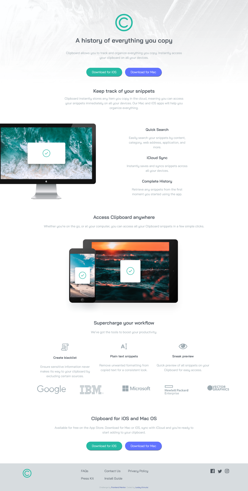
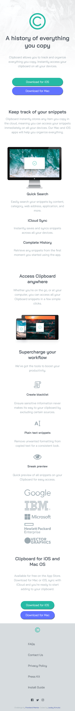

# Frontend Mentor - Clipboard landing page solution

This is a solution to the [Clipboard landing page challenge on Frontend Mentor](https://www.frontendmentor.io/challenges/clipboard-landing-page-5cc9bccd6c4c91111378ecb9).
Frontend Mentor challenges help me improve my coding skills by building realistic projects.

## Table of contents

- [Overview](#overview)
  - [The challenge](#the-challenge)
  - [Screenshot](#screenshot)
  - [Links](#links)
- [My process](#my-process)
  - [Built with](#built-with)
  - [What I learned](#what-i-learned)
  - [Continued development](#continued-development)
- [Author](#author)

## Overview

### The challenge

Make the Clipboard landing page, and make it responsive as such:

- View the optimal layout for the site depending on their device's screen size
- See hover states for all interactive elements on the page

### Screenshot

Screenshot of laptop view of the page .... Looks pretty neat to my eyes😃.

Screenshot of mobile view of the page .... Not so bad, have to improve a bit, not lost at least, getting there

### Links

- Solution URL:  (https://github.com/issagoodlifeInc/clipboard-page.git)
- Live Site URL:  (https://issagoodlifeinc.github.io/clipboard-page/)

## My process

### Built with

- Semantic HTML5 markup
- CSS custom properties
- Flexbox
- CSS Grid
- Laptop-first workflow

### What I learned

Flexbox and Grid are my friends 👊🏾

I'm not quite there with my paddings and margin deliveries , have to work on those

Loved every second doing this

### Continued development

- Padding and Margins

- Reduction of media queries

- Speed of completion - took almost half a day for this

## Author

- Website - [Lesley Kimutai](https://leskim.github.io/myweb/)
- Frontend Mentor - (https://www.frontendmentor.io/profile/Leskim)
